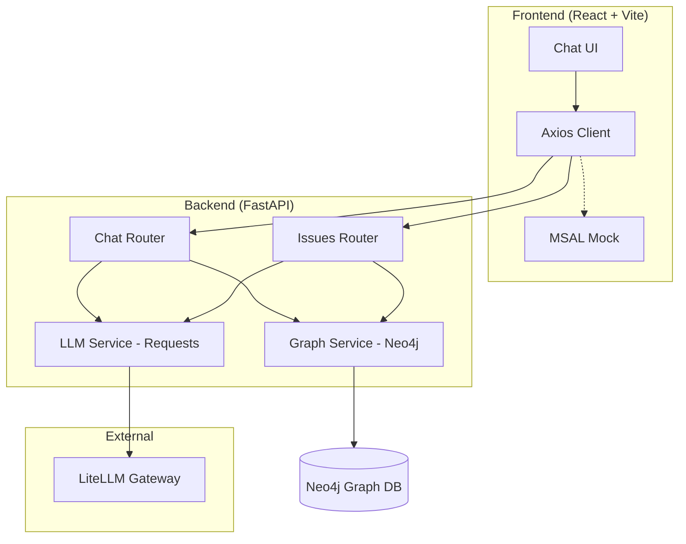

# AI Painpoint Discovery Assistant

## Product Overview
Managers often face business pain points but lack the technical vocabulary (e.g., NLP vs. CV vs. forecasting) to know which internal IT/AI team can help. 

The **AI Painpoint Discovery Assistant** is a chat application where managers describe their pain points in natural language. An LLM acts as an internal AI product discovery assistant, driving the conversation and asking follow-up questions. Once enough context is gathered, the system automatically structures the issue, classifies it into relevant capability domains, and routes it to the most appropriate internal IT/AI team using a graph database.

## Key Features (MVP)
*   **LLM-Driven Discovery:** Guides non-technical users to provide actionable business context without jargon.
*   **Authentication-Free (Mock Mode):** MSAL is completely bypassed. The app runs directly for local development and demos.
*   **Automated Classification:** Analyzes chat transcripts to output structured data via the `requests` library.
*   **Graph-Based Architecture:** Uses Neo4j to store relationships between Users, Conversations, Issues, and Teams.

## Architecture Diagram



## Setup Instructions

### Prerequisites
*   Python 3.10+
*   Node.js and npm
*   `uv` (Fast Python package manager)
*   Docker (for Neo4j)

### 1. Database Setup
Start the Neo4j database using Docker Compose:
```bash
docker-compose up -d neo4j
```
*Wait a few seconds for Neo4j to initialize. It will be available at `bolt://localhost:7687`.*

### 2. Backend Installation & Environment
Navigate to the backend directory, install dependencies, and setup `.env`:

```bash
cd backend
uv sync
```

Ensure `backend/.env` has:
```env
OPENAI_API_KEY=your_key
OPENAI_BASE_URL=https://aiml-llmgateway-litellm-api-ai-tooling.dev.aiml.azure.dsb.dk
OPENAI_MODEL_NAME=gpt-4o-standard_flow11
NEO4J_URI=bolt://localhost:7687
```

### 3. Frontend Installation
```bash
cd frontend/src/app
npm install
```

## Running the Application

### Start the Backend
```bash
cd backend
uv run uvicorn app.main:app --host 0.0.0.0 --port 8000 --reload
```

### Start the Frontend
```bash
cd frontend/src/app
npm run dev
```
*Frontend will be at http://localhost:5173 (pointing to backend on 8000).*

## Testing & Verification

We use **pytest** for backend verification. To run all tests:

```bash
cd backend
uv run pytest
```

**Verified Workflows:**
- ✅ **API Health:** `GET /`
- ✅ **Chat Initialization:** `POST /api/chat/start`
- ✅ **LLM Connectivity:** Direct `requests` calls to LiteLLM Gateway.
- ✅ **Mock Auth:** Frontend bypasses MSAL for zero-config startup.